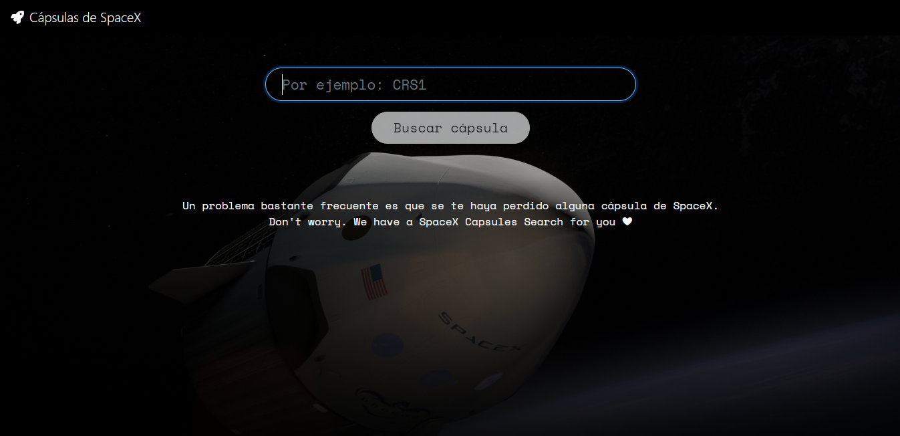
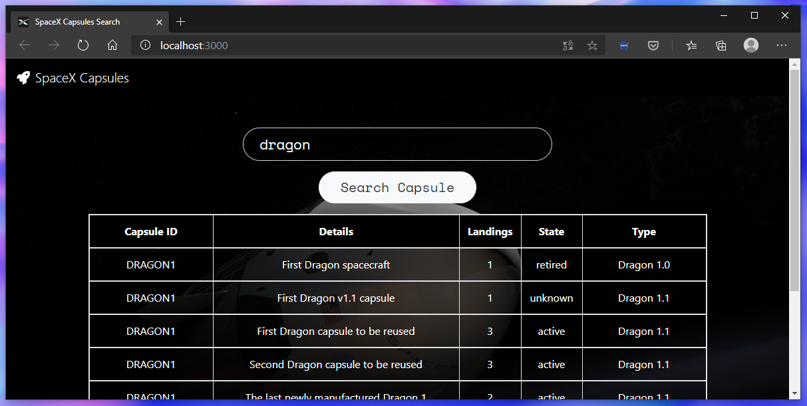

<h1 align="center">🚀 SpaceX Capsules Search 🔍</h1>

<p align="center">Find <a href="https://www.spacex.com/">SpaceX</a> Capsules with details with this <a href="https://reactjs.org/">React App</a></p>

<p align="center"><a href="https://reactjs.org/"></a></p>




## 📦 Deployment
Once you have the repository **spacex-capsules-search**, run this command from the project directory:

🔽 Install all dependencies...
```bash
npm install
```
🚀 Run and launch
```bash
npm start
```
