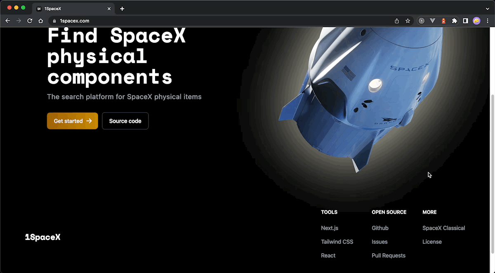

<p align="center">
  
  <h1 align="center">1spaceX.com</h1>
</p>


<p align="center">🚀 Find <a href="https://www.spacex.com/">SpaceX</a> physical components with this <a href="https://nextjs.org">Next.js App</a> 🔍</p>

<p align="center">
  <a href="https://nodejs.org/"></a>
  <a href="https://reactjs.org/"></a>
  <a href="https://nextjs.org"></a>
  <a href="https://tailwindcss.com"></a>
  <a href="https://github.com/r-spacex/SpaceX-API"></a>
</p>

<p align="center">
  🤗 Thank you for visiting this space exploration project, help spread it by giving a star 🌟<br />
  <br />
  <a href="https://github.com/360macky/1spaceX/stargazers"></a><br />
</p>





## 🤖 Concept

1spaceX is a web app that helps you to find all the information about SpaceX components. You can find information about the capsules, cores, launches, payloads and rockets.

## 📦 Deployment

**1spaceX** is deployed in [Vercel](https://vercel.com/), you can visit the app in [1spaceX.com](https://1spaceX.com/).

## 🛠 Core Development

## 🖐 User Interface

**1spaceX** UI is built with [TailwindCSS](https://tailwindcss.com/), a utility-first CSS framework for rapidly building custom designs. Also with [Flowbite](https://flowbite.com/), a TailwindCSS UI Kit.

It is responsive and mobile-first, so you can use it in any device.

Available with dark mode based on the user's system preferences.

### 🛩 Deployment

Run the development server:

```bash
npm run dev
```

Open [http://localhost:3000](http://localhost:3000) with your browser to see the result.


## 🤲 Contributing
Do you would like to contribute? Do you want to be the author of a new feature? Awesome! please fork the repository and make changes as you like. [Pull requests](https://github.com/360macky/1spaceX/pulls) are warmly welcome.


## 📃 License
Distributed under the MIT License.
See [`LICENSE`](./LICENSE) for more information.
