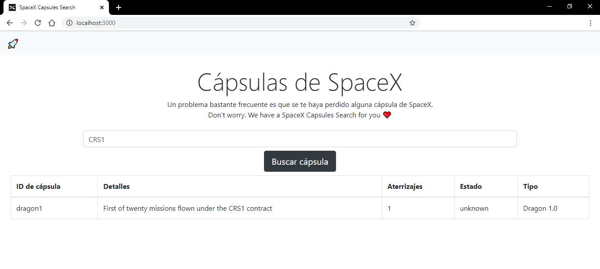

# SpaceX Capsules Search 🚀

[](https://reactjs.org/)

Buscador de cápsulas de SpaceX desarrollado en React.



## 📦 Deployment
Una vez tienes el repositorio **spacex-capsules-search**, ejecuta este comando desde el directorio del proyecto:

```bash
npm start
```
