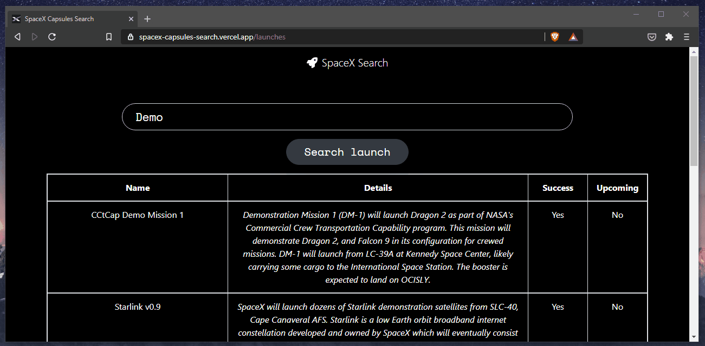
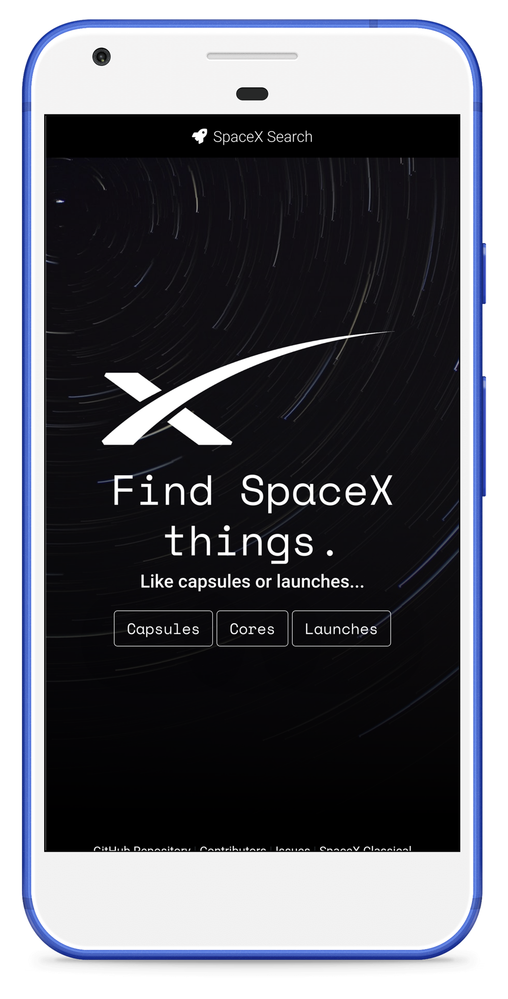

<p align="center">
  
  <h1 align="center">1spaceX.com</h1>
</p>


<p align="center">🚀 Find <a href="https://www.spacex.com/">SpaceX</a> data with this <a href="https://reactjs.org/">React App</a> 🔍</p>

<p align="center">
  <a href="https://nodejs.org/"></a>
  <a href="https://reactjs.org/"></a>
  <a href="https://getbootstrap.com/"></a>
  <a href="https://reactrouter.com/"></a>
  <a href="https://github.com/r-spacex/SpaceX-API"></a>
</p>

<p align="center">
  🤗 Thank you for visiting this space exploration project, help spread it by giving a star 🌟<br />
  <br />
  <a href="https://github.com/360macky/1spaceX/stargazers"></a><br />
</p>





## 🚀 Development

**1spaceX.com** is a web app built with React 18. It uses [Bootstrap](https://getbootstrap.com/) as CSS design library but I also integrate other styles for customization of the web app.

Also, in some components the [`styled-components`](https://www.npmjs.com/package/styled-components) library is used.

There is a page for each physical component like: capsules, cores, launches, payloads and rockets.
In each page there is a search bar, and the cards associated to that physical component.

## 📦 Deployment

Once you have the repository **1spaceX**, run this command from the project directory:

🔽 Install all dependencies...

```bash
npm install
```

🚀 Run and launch

```bash
npm start
```

🧪 Run tests

```bash
npm test
```


## 🎨 Design
1spaceX has a totally responsive design based on media queries rules and Bootstrap 5 practices.
You can test it by accessing the web from your mobile browser.




## 🧪 Testing
**1spaceX** is integrated with a progressive unit-testing in the core components. This unit-testing is implemented with `@testing-library/react`.

*Footer unit-testing example:*
```javascript
import React from 'react';
import { render } from '@testing-library/react';
import Footer from './Footer';

describe('Suite test Footer', () => {
  it('should render GitHub Repository of the footer', () => {
    const { getByText } = render(<Footer />);
    const GitHubRepositoryLink = getByText(/GitHub Repository/i);
    expect(GitHubRepositoryLink).toBeInTheDocument();
  });
});
```


## 📂 Folder Structure of 1spaceX App
/src
-  **/components**: Components used in all the app (including the main App.js)
-  **/images**: Images used in the app
-  **/pages**: Pages rendered in the app. Each page has its own folder here.
-  **/utils**: Utility functions.


## 🎁 Dependencies
Current versions of our dependencies:
- @fortawesome/fontawesome-svg-core: `^6.1.1`
- @fortawesome/free-solid-svg-icons: `^6.1.1`
- @fortawesome/react-fontawesome: `^0.1.18`
- @testing-library/jest-dom: `^5.16.3`
- @testing-library/react: `^13.0.0`
- @testing-library/user-event: `^14.0.4`
- bootstrap: `^5.1.3`
- react: `^18.0.0`
- react-dom: `^18.0.0`
- react-router-dom: `^6.3.0`
- react-scripts: `5.0.0`
- styled-components: `5.3.5`


## 🤲 Contributing
Do you would like to contribute? Do you want to be the author of a new feature? Awesome! please fork the repository and make changes as you like. [Pull requests](https://github.com/360macky/1spaceX/pulls) are warmly welcome.


## 📃 License
Distributed under the MIT License.
See [`LICENSE`](./LICENSE) for more information.
