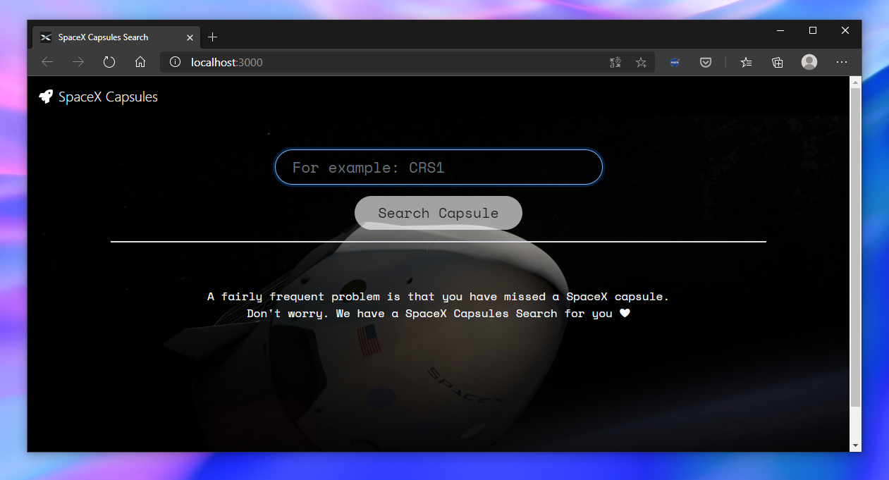
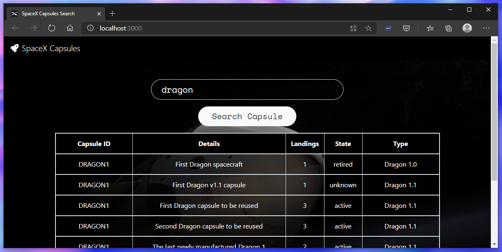

<p align="center">
  
</p>

--- 

<p align="center">🚀 Find <a href="https://www.spacex.com/">SpaceX</a> Capsules with details with this <a href="https://reactjs.org/">React App</a> 🔍</p>

<p align="center">
  <a href="https://nodejs.org/"></a>
  <a href="https://reactjs.org/"></a>
  <a href="https://getbootstrap.com/"></a>
  <a href="https://reactrouter.com/"></a>
  <a href="https://github.com/r-spacex/SpaceX-API"></a>
</p>





## 📦 Deployment

Once you have the repository **spacex-capsules-search**, run this command from the project directory:

🔽 Install all dependencies...

```bash
npm install
```

🚀 Run and launch

```bash
npm start
```


## 🧪 Testing
**SpaceX Search App** is integrated with a progressive unit-testing in the core components. This unit-testing is implemented with `@testing-library/react`.

*Footer unit-testing example:*
```javascript
import React from 'react';
import { render } from '@testing-library/react';
import Footer from './Footer';

describe('Suite test Footer', () => {
  it('should render GitHub Repository of the footer', () => {
    const { getByText } = render(<Footer />);
    const GitHubRepositoryLink = getByText(/GitHub Repository/i);
    expect(GitHubRepositoryLink).toBeInTheDocument();
  });
});
```

## 📃 License
Distributed under the MIT License.
See [`LICENSE`](./LICENSE) for more information.
